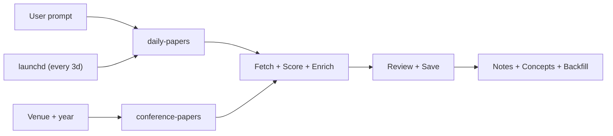

# Daily Paper Recommendation Skills

[](#overview)
[](#quick-start)
[](#adapt-to-your-domain)
[](#overview)
[](#sources)

A Claude Code-first workflow for discovering, ranking, reviewing, and note-taking on new papers inside **Obsidian**.

Default preset: **Healthcare AI**.  
Core idea: one prompt triggers a full paper pipeline:

1. Fetch and rank papers
2. Write a daily recommendation note
3. Generate deeper notes for the strongest papers

## Table of Contents

- [Quick Start](#quick-start)
- [Automation (optional)](#automation-optional)
- [Adapt to Your Domain](#adapt-to-your-domain)
- [Overview](#overview)
- [Sources](#sources)
- [Configuration](#configuration)
- [Repo Layout](#repo-layout)
- [Roadmap](#roadmap)
- [Notes](#notes)

## Quick Start

This is the shortest path for a non-technical researcher.

1. Install **Claude Code** on your machine (`claude` CLI).
2. Download this repository and open it in Claude Code.
3. Make sure you have an **Obsidian vault** for your research.
4. Install these skill folders into `~/.claude/skills/`:
   - `skills/_shared`
   - `skills/daily-papers`
   - `skills/daily-papers-fetch`
   - `skills/daily-papers-review`
   - `skills/daily-papers-notes`
   - `skills/paper-reader`
   - `skills/conference-papers` (optional — only if you want venue-specific runs)
5. Best practice: create **symbolic links** from this repo into `~/.claude/skills/` so the repo and installed skills stay synced automatically.
6. Open `skills/_shared/user-config.json` and ask Claude Code to adapt it to:
   - your research domain
   - your Obsidian vault path
   - your folder names for daily papers, notes, and concepts
7. In Claude Code, run one of:
   - `today's paper recommendations`
   - `paper recommendations from the last 3 days`
   - `paper recommendations from the last week`
8. Open Obsidian and check the outputs:
   - daily recommendation note
   - paper notes
   - concept notes
   - refreshed indexes, if enabled

Good first test: `paper recommendations from the last 3 days`.

Example prompt for Claude Code:

> Update `skills/_shared/user-config.json` for my setup. My research domain is computational neuroscience. My Obsidian vault is at `/path/to/my/vault`. Please rewrite the domain description, focus themes, related themes, exclusions, ranking keywords, arXiv categories, note taxonomy, and Obsidian folder paths. Keep the pipeline structure unchanged.

## Automation (optional)

If you want the pipeline to run on a schedule (so papers show up in Obsidian
without you having to ask), see [`automation/`](automation/). It ships:

- a launchd job that fires `runner.sh` daily at 9am and self-throttles to a
  ~3-day cadence (the actual "every 3 days" interval)
- a weekly wiki-backfill launchd job
- a Cowork monitor artifact that shows next/last run, today's status, and a
  conference-paper search form

One-shot install:

```bash
cd automation
./install.sh
```

Full setup, override knobs, and troubleshooting live in
[`automation/README.md`](automation/README.md). The automation is fully
optional — without it, the skills still work as on-demand prompts.

## Adapt to Your Domain

The infrastructure is reusable. The default config is not.

If you work outside Healthcare AI, start by editing:

- `paths.obsidian_vault`
- `paths.paper_notes_folder`
- `paths.daily_papers_folder`
- `paths.concepts_folder`
- `paths.temp_dir`
- `domain.name`
- `domain.summary`
- `domain.focus_themes`
- `domain.related_themes`
- `domain.out_of_scope_examples`
- `domain.borderline_include_examples`
- `daily_papers.keywords`
- `daily_papers.negative_keywords`
- `daily_papers.domain_boost_keywords`
- `daily_papers.arxiv_categories`
- `paper_notes_taxonomy.categories`

What usually stays the same:

- multi-source fetching
- rolling time windows
- deduplication
- history tracking
- Obsidian output flow

Practical advice:

- Ask Claude Code to rewrite `user-config.json` for your field.
- Test with a 1-day or 3-day run.
- Tighten keywords and exclusions if results are noisy.

Common mistake:

- Changing only `domain.name` and `domain.summary` is not enough.
- If you leave the old keywords, taxonomy, or Obsidian paths in place, the system will behave like the old domain and may write to the wrong vault.

## Overview

### What It Does

- Fetches papers from multiple sources
- Scores them with domain-aware keywords
- Deduplicates across sources and history
- Enriches metadata for better review quality
- Writes daily recommendations into Obsidian
- Generates deeper notes for selected papers

### Pipeline



### Why It Exists

Most paper feeds stop at "here are links." This project is meant to support a real research routine:

- better source coverage
- domain-aware ranking
- memory across days
- direct integration with a personal knowledge system

## Sources

Current source mix:

**For daily / rolling-window runs (`daily-papers`):**

- Hugging Face Daily
- Hugging Face Trending
- arXiv
- PubMed
- bioRxiv
- medRxiv

**For venue-specific runs (`conference-papers`):**

- OpenReview — NeurIPS / ICML / ICLR / COLM / TMLR
- Semantic Scholar — MICCAI / CHIL / MLHC / AMIA / IPMI / MIDL / ISBI
  (recommends `SEMANTIC_SCHOLAR_API_KEY` for higher throughput)

Time-window support (daily-papers):

- today
- last 3 days
- last week
- other rolling windows via `--days N`

Important constraints:

- Hugging Face Trending does not provide a historical trending endpoint, so historical multi-day runs cannot perfectly reconstruct past trending states.
- Semantic Scholar throttles to ~100 requests / 5 minutes without an API key — fine for a single venue, painful if you sweep several venues back-to-back.

## Configuration

Single source of truth:

- `skills/_shared/user-config.json`

Key settings:

- Obsidian paths and folders
- domain summary and themes
- ranking keywords and exclusions
- arXiv categories
- `min_score`
- `top_n`
- note taxonomy
- automation toggles

Current defaults include:

- domain preset: `Healthcare AI`
- `top_n = 40`
- `min_score = 1`
- automatic index refresh enabled
- git commit and push disabled inside the automation config

## Repo Layout

```text
skills/
  _shared/                  shared config + wiki helpers (backfill, index, post-ingest)
  daily-papers/             rolling-window pipeline (today / last 3 days / last week)
  daily-papers-fetch/       multi-source fetch + score + enrich subskill
  daily-papers-review/      review + save + history bookkeeping
  daily-papers-notes/       deep notes generation for top-ranked papers
  paper-reader/             deep-dive note on a specific paper
  conference-papers/        venue-specific pipeline (NeurIPS / MICCAI / …)

automation/                 macOS launchd + Cowork monitor (optional)
  install.sh                one-shot installer
  launchd/                  runner.sh + plists (daily-papers + backfill-stubs)
  monitor/                  Cowork artifact source (paper-pipeline-monitor.html)
```

Key files:

- `skills/_shared/user-config.json` — single source of truth for paths, domain, ranking
- `skills/daily-papers/fetch_and_score.py`
- `skills/daily-papers/enrich_papers.py`
- `skills/daily-papers-review/update_history.py`
- `skills/conference-papers/conference_pipeline.py`
- `automation/launchd/runner.sh`
- `automation/monitor/paper-pipeline-monitor.html`

## Roadmap

- [x] Add a full English version
- [x] Add a GUI to make the workflow more user friendly *(Cowork monitor artifact in `automation/monitor/`)*
- [x] Add venue-specific search *(see `skills/conference-papers/`)*
- [x] Add scheduled automation *(see `automation/`)*
- [ ] Add saving PDFs to Zotero
- [ ] Learn from user interactions over time
- [ ] One-click "run now" from the monitor *(currently clipboard-based; see `automation/README.md`)*

## Notes

- The corresponding skill folders under `~/.claude/skills/` should be linked to this repo for live sync.
- This repo is derived from [huangkiki/dailypaper-skills](https://github.com/huangkiki/dailypaper-skills), with substantial local adaptation for multi-source retrieval, Obsidian integration, and healthcare-focused ranking.
