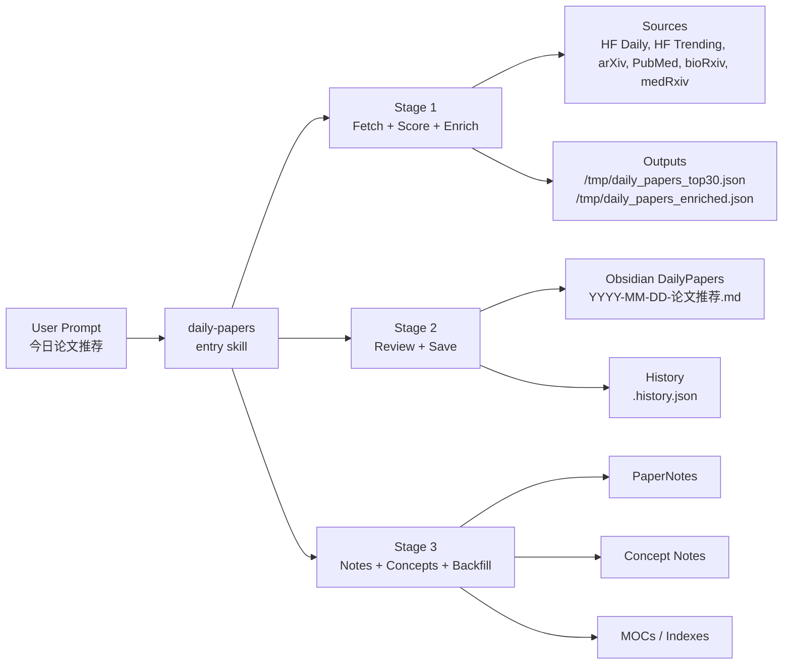

# Daily Paper Recommendation Skills

[](#what-it-includes)
[](#obsidian-native-workflow)
[](#configuration)
[](#pipeline-overview)
[](#sources)

An opinionated, production-ready Codex skill suite for discovering, filtering, reviewing, and note-taking on new research papers with a strong focus on **Healthcare AI**.

It turns a single natural-language request into a full literature workflow:

1. Fetch and rank candidate papers from multiple research sources
2. Generate sharp recommendation writeups for an Obsidian research vault
3. Produce full paper notes and concept links for the strongest papers

Built for people who want more than a paper dump, the workflow emphasizes **topic relevance**, **cross-source deduplication**, **time-window-aware retrieval**, **history-aware recommendations**, and **structured downstream note generation**.

## At a Glance

- One-command daily paper pipeline for Codex
- Six-source retrieval across ML, biomedical, and medical preprint ecosystems
- Rolling time windows such as today, last 3 days, and last week
- History-aware recommendations to reduce repetition
- Obsidian-native outputs for daily reviews, concept notes, and paper notes
- Shared-config architecture with domain tuning in one file

## Quick Start

1. Point the shared config at your local vault and folders in `skills/_shared/user-config.json`.
2. Ensure the linked skill directories under `~/.codex/skills/` point to this repository.
3. In Codex, run one of the top-level prompts:
   - `今日论文推荐`
   - `过去3天论文推荐`
   - `过去一周论文推荐`
4. Let the pipeline generate:
   - ranked candidates
   - a daily recommendation note
   - deep notes for the strongest papers
   - refreshed concept and paper indexes when enabled

## Architecture



## Why This Project

Most "daily papers" setups stop at scraping headlines. This one is built to support an actual research routine:

- Multi-source paper intake instead of a single feed
- Domain-specific ranking instead of generic popularity sorting
- Rolling windows for `today`, `last 3 days`, `last week`, and similar requests
- Cross-day recommendation memory to avoid repeating the same papers
- Obsidian-native outputs for recommendations, notes, concepts, and MOCs
- Full-skill pipeline orchestration from a single user-facing command

The current shared configuration targets:

- Clinical foundation models
- Longitudinal EHR modeling
- Patient trajectory modeling
- Clinical LLMs
- Multimodal clinical modeling
- Causal and intervention modeling in healthcare
- Medical world models and virtual patients

## Launch Highlights

- Multi-source retrieval with domain-aware ranking instead of one-feed scraping
- Better coverage for healthcare research by combining ML feeds, biomedical indexing, and medical preprints
- Practical support for sparse days and weekends through source-aware fallback behavior
- Recommendation memory that tracks prior appearances and supports re-recommendation labeling
- Downstream note generation that turns selection into a reusable knowledge system

## What It Includes

Tracked skill directories:

- `skills/_shared`
- `skills/daily-papers`
- `skills/daily-papers-fetch`
- `skills/daily-papers-review`
- `skills/daily-papers-notes`
- `skills/paper-reader`

Core scripts and logic:

- `skills/daily-papers/fetch_and_score.py`
- `skills/daily-papers/enrich_papers.py`
- `skills/daily-papers-review/update_history.py`
- `skills/_shared/user-config.json`

## Pipeline Overview

### Stage 1. Fetch + Score + Enrich

The fetch stage is orchestrated by the `daily-papers` entry skill and implemented primarily through:

- `fetch_and_score.py`
- `enrich_papers.py`

It performs:

- Multi-source ingestion
- Keyword and domain-aware scoring
- Cross-source entity merging
- Historical deduplication
- Metadata enrichment for downstream review

### Stage 2. Review + Save

The review stage reads the enriched candidate set and produces a recommendation file in Obsidian with:

- A high-signal editorial summary
- Tiered paper triage
- Source attribution
- Re-recommendation markers
- Existing-note linking
- Strong-paper prioritization for note generation

### Stage 3. Notes + Concepts + Backfill

The notes stage generates deep paper notes for top picks and expands the concept library by:

- Creating or updating concept notes
- Generating full paper notes via `paper-reader`
- Backfilling note links into the daily recommendation file
- Refreshing MOC pages when enabled

## Sources

This version pulls from a broader source mix than the original lightweight setup.

Primary sources:

- Hugging Face Daily
- Hugging Face Trending
- arXiv
- PubMed
- bioRxiv
- medRxiv

Why this matters:

- `Hugging Face Daily` helps surface fresh applied ML releases
- `Hugging Face Trending` adds community momentum, especially useful on weekends
- `arXiv` covers core ML and AI categories via configurable category filters
- `PubMed` improves biomedical and clinically grounded coverage
- `bioRxiv` and `medRxiv` expand access to preprints relevant to translational and medical AI

## Time Windows and Retrieval Behavior

The workflow is not limited to "today only." It supports rolling windows through natural-language requests and `--days N`.

Examples:

- `今日论文推荐`
- `过去3天论文推荐`
- `过去一周论文推荐`
- `最近5天论文`

Current behavior:

- Default mode: fetch papers for the current day
- Multi-day mode: fetch an inclusive rolling window ending on the target date
- Supported patterns in the skills currently map common phrases to values like `3`, `7`, and `14` days
- `top_n` is multiplied by the requested number of days, so larger windows return larger candidate sets

Important constraints:

- Hugging Face Trending does **not** expose a historical trending endpoint, so historical multi-day runs cannot reconstruct past trending states
- Weekend behavior is intentionally different because arXiv updates are weaker and Hugging Face Daily is often sparse on weekends
- History deduplication is relaxed for strong weekend trending papers so genuinely hot papers can resurface when appropriate

## Ranking and Deduplication

Paper selection is not random and not just "latest first."

The current pipeline combines:

- Positive keyword matches
- Negative keyword filtering
- Domain boost keywords
- Trending upvote boosts for relevant Hugging Face papers
- Source-priority-based field merging

Cross-source deduplication uses multiple identifiers when available:

- `paper_id`
- DOI
- arXiv ID
- PubMed ID
- Title hashing fallback

This helps collapse the same work when it appears across:

- arXiv and Hugging Face
- preprint servers and PubMed
- multiple source URLs with slightly different metadata

## History Awareness

The repo keeps recommendation memory through:

- `DailyPapers/.history.json` inside the configured vault

That history is used to:

- Avoid recommending the same paper repeatedly across days
- Mark re-recommended papers with prior recommendation dates
- Backfill older strong papers if the current day is too sparse
- Retain a rolling recent history window

This makes the workflow substantially more usable than a stateless scraper.

## Metadata Enrichment

After ranking, papers are enriched in batch to support better review quality.

The enrichment layer extracts or infers fields such as:

- `figure_url`
- `authors`
- `affiliations`
- `section_headers`
- `captions`
- `has_real_world`
- `method_names`
- `method_summary`

Implementation notes:

- Concurrent fetching via `asyncio`
- `curl` subprocesses for HTTP retrieval
- HTML parsing through lightweight regex-based extractors
- PDF text fallback for affiliation extraction
- Source-aware fallback logic when one extraction route fails

This extra structure is what allows the review stage to produce more specific commentary than generic abstract summaries.

## Configuration

There is one shared source of truth:

- `skills/_shared/user-config.json`

This file currently controls:

- Obsidian vault and folder paths
- Domain name and domain summary
- Focus themes and related themes
- Positive and negative ranking keywords
- Domain boost keywords
- arXiv categories
- `min_score`
- `top_n`
- Frontmatter tags
- Paper note taxonomy
- Automation toggles such as index refresh and git behavior

Current domain preset:

- `Healthcare AI`

Current default ranking posture:

- `min_score = 1`
- `top_n = 40`

Current automation defaults:

- `auto_refresh_indexes = true`
- `git_commit = false`
- `git_push = false`

## Obsidian-Native Workflow

This repo is built around an Obsidian research vault, not just a terminal output.

Outputs include:

- Daily recommendation files in `DailyPapers/`
- Paper notes in `PaperNotes/`
- Concept notes under the configured concepts folder
- MOC refresh support for concepts and paper collections

The result is a loop where paper discovery feeds directly into a navigable personal research system.

## Repo Layout

```text
skills/
  _shared/
    user-config.json
  daily-papers/
    fetch_and_score.py
    enrich_papers.py
    SKILL.md
  daily-papers-fetch/
    SKILL.md
  daily-papers-review/
    SKILL.md
    update_history.py
  daily-papers-notes/
    SKILL.md
  paper-reader/
    SKILL.md
```

## Typical Usage

From the user side, the top-level interface is intentionally simple:

- `今日论文推荐`
- `过去3天论文推荐`
- `过去一周论文推荐`

Internally, that single request chains:

1. `daily-papers-fetch`
2. `daily-papers-review`
3. `daily-papers-notes`

The user does not need to manually orchestrate the three stages unless debugging a specific step.

## Operational Notes

A few behaviors are deliberate and worth knowing:

- The fetch stage is designed to minimize token usage by pushing source collection and ranking into Python scripts
- The review and notes stages are tuned for stronger editorial quality and richer vault integration
- Multi-day retrieval is supported, but some sources are inherently better for current-day freshness than historical reconstruction
- The workflow is domain-configurable, but this repo currently ships with a strong healthcare AI bias in its shared config

## Local Sync Model

This repository is also used as a live development source for local Codex skills.

Current sync model:

- The corresponding directories under `~/.codex/skills/` are symbolic links to this repository
- Editing either location updates the same underlying files
- New files added in the linked directories are immediately visible from both paths

That makes this repo both:

- A versioned skill source
- A live local skill workspace

## Upstream Acknowledgement

This skill set is derived from [huangkiki/dailypaper-skills](https://github.com/huangkiki/dailypaper-skills), with substantial local adaptation for:

- multi-source retrieval
- healthcare-focused ranking
- richer metadata enrichment
- Obsidian vault integration
- rolling-window recommendation workflows
- stronger note-generation orchestration

## Status

This version is no longer just a mirror. It is a customized research workflow layer for paper discovery, triage, and note production.

If you are building a serious literature routine around Codex + Obsidian, this is the version meant to hold up under daily use.
